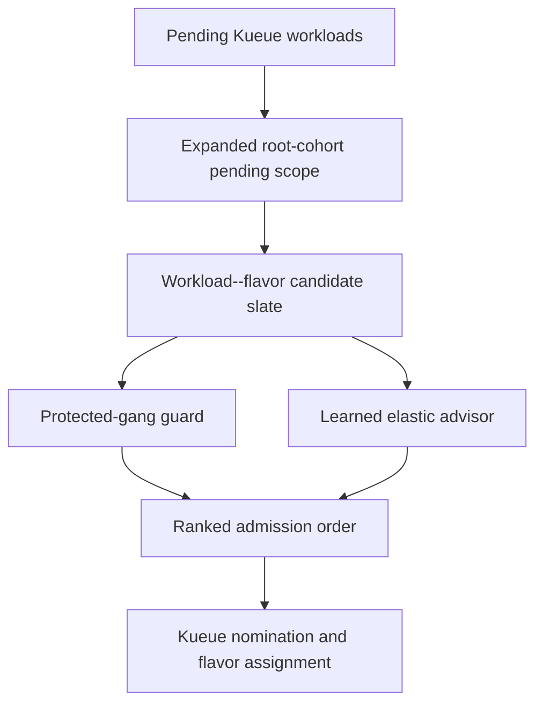
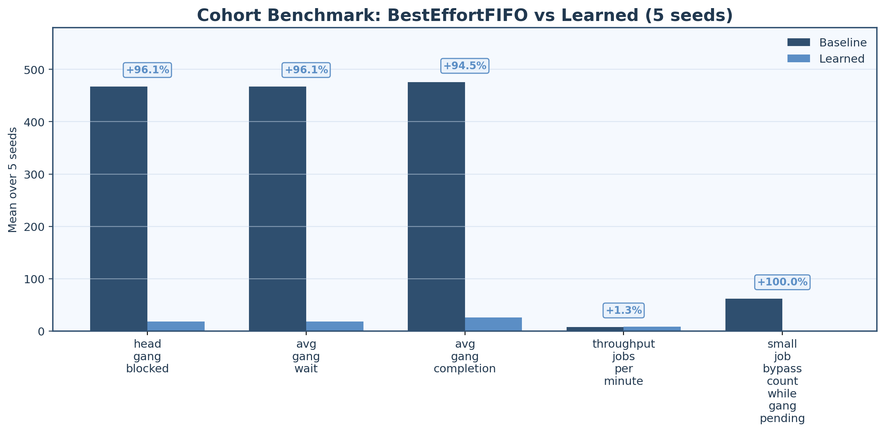
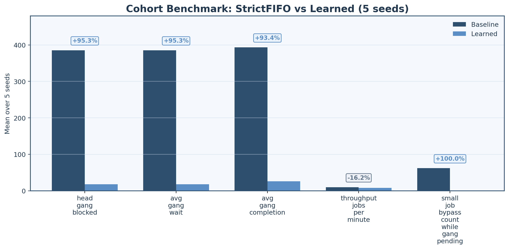
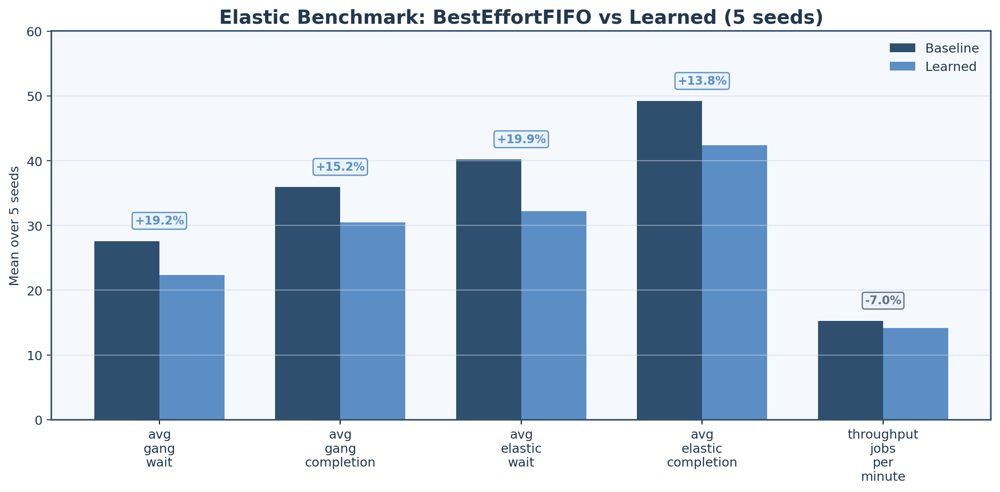
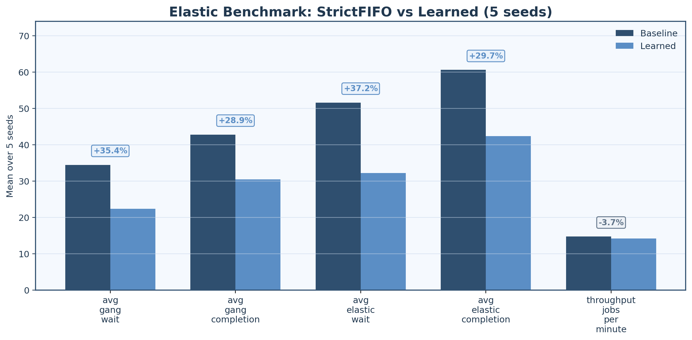

# AdmiRL

AdmiRL is a research artifact for **learning-augmented admission control in
Kueue**. The core idea is simple: before worrying about node placement, protect
the right gang workloads at the **admission boundary**, and use learning only
for the harder part of the problem, namely **elastic workload--flavor choice
under contention**.

This repository contains:

- the AdmiRL model server used in the live admission loop
- the Kueue-side live benchmark harness
- committed learned checkpoints for the cohort and elastic policies
- the committed **five-seed, 64-jobs-per-seed** live KWOK suite used for the
  paper artifact
- figures, reports, and observability assets

## What Problem This Solves

In upstream Kueue, an older blocked gang can remain first in its own
`ClusterQueue` and still lose at the cohort level when younger sibling
workloads borrow the same scarce `ResourceFlavor` first. This is not primarily
a pod-placement failure. It is an **admission visibility and ordering** failure.

AdmiRL addresses two related gaps:

1. **Cohort-level gang protection**  
   Older blocked gangs should stay visible across scheduling cycles and should
   not be repeatedly bypassed by smaller overlapping jobs.

2. **Elastic admission quality**  
   When several workload--flavor choices are feasible, FIFO order does not tell
   Kueue which one is likely to lead to better downstream progress.

## System at a Glance

AdmiRL has two pieces:

- **Protected-gang mechanism**: expands admission scope to relevant same-root
  cohort pending workloads, keeps one blocked older gang protected across
  cycles, and defers overlapping smaller jobs that would otherwise consume the
  protected flavor first.
- **Learning-augmented advisor**: ranks workload--flavor options for elastic GPU
  jobs when multiple safe choices exist.



The design is intentionally narrow:

- **mechanism** handles starvation correctness
- **learning** improves elastic admission decisions
- Kubernetes and Kueue still own legality checks, quotas, borrowing, and pod
  placement

## Associated Paper

The paper source in this repository lives under [`paper/`](paper/), including:

- [`paper/admirl-kueue-paper.tex`](paper/admirl-kueue-paper.tex)
- [`paper/references.bib`](paper/references.bib)
- [`paper/figures/`](paper/figures/)

The paper’s central claim is that **Kueue gang starvation under cohort
borrowing should be treated as an admission-control problem first**, and that
learning is most useful for **elastic admission optimization**, not for
starvation correctness itself.

## Artifact Claims

The main committed artifact is:

- [`test/results/64job-suite-v1/`](test/results/64job-suite-v1/)

The final learned-vs-baseline suite uses seeds `7, 11, 13, 17, 23` with `64`
jobs per seed for both benchmark families.

Headline committed results:

- **Cohort benchmark vs `BestEffortFIFO`**
  - `96.1%` lower head-gang blocked time
  - `94.5%` lower average gang completion time
  - `0` small-job bypass while the protected gang is pending
- **Cohort benchmark vs `StrictFIFO`**
  - `95.3%` lower head-gang blocked time
  - `0` small-job bypass
- **Elastic benchmark vs `BestEffortFIFO`**
  - `19.2%` lower average gang wait
  - `19.9%` lower average elastic wait
- **Elastic benchmark vs `StrictFIFO`**
  - `35.4%` lower average gang wait
  - `37.2%` lower average elastic wait

### Results at a Glance

| Benchmark | Main takeaway |
| --- | --- |
| Cohort vs `BestEffortFIFO` | Protected-gang admission removes repeated bypass and sharply lowers blocked time |
| Cohort vs `StrictFIFO` | Protection still matters at the cohort boundary, even when local FIFO is strict |
| Elastic vs `BestEffortFIFO` | Learned workload--flavor ranking lowers wait and completion times |
| Elastic vs `StrictFIFO` | Learning helps most when FIFO provides the weakest flavor signal |

Main comparison plots:

<table>
  <tr>
    <td align="center" width="50%">
      <b>Cohort vs BestEffortFIFO</b><br/>
      
    </td>
    <td align="center" width="50%">
      <b>Cohort vs StrictFIFO</b><br/>
      
    </td>
  </tr>
  <tr>
    <td align="center" width="50%">
      <b>Elastic vs BestEffortFIFO</b><br/>
      
    </td>
    <td align="center" width="50%">
      <b>Elastic vs StrictFIFO</b><br/>
      
    </td>
  </tr>
</table>

Supporting tradeoff plot:

- [`figures/final5_small_wait_tradeoff.png`](figures/final5_small_wait_tradeoff.png) for the small-job wait tradeoff view.

## Repository Layout

- [`model_server/`](model_server/)  
  Flask model server, runtime policy logic, PPO trainer, and observability
  bundle.
- [`test/kueue/`](test/kueue/)  
  Live Kueue benchmark harness and suite runners.
- [`test/kwok/`](test/kwok/)  
  Fake-node generation and KWOK-related helpers.
- [`test/results/checkpoints-rerun-20260419/`](test/results/checkpoints-rerun-20260419/)  
  Committed learned checkpoints used in the final live runs.
- [`test/results/64job-suite-v1/`](test/results/64job-suite-v1/)  
  Committed final live benchmark outputs.
- [`paper/`](paper/)  
  Paper source, paper figures, and paper-generation helpers.

## Prerequisites

You will need:

- Python `3.11+`
- Go `1.22+`
- Docker Desktop
- `kubectl`
- `kind`
- `kwokctl`
- `kwok`

Python setup:

```bash
python3 -m venv .venv
source .venv/bin/activate
pip install -r model_server/requirements.txt
```

If you are setting this up on macOS, a typical tool install path is:

```bash
brew install kubectl kind kwok
```

`kwokctl` may need a separate install depending on your local packaging setup.

## Source Checkouts

The live suite compares two Kueue trees:

- an **AdmiRL-modified local Kueue checkout** for the learned/protected arms
- an **upstream Kueue checkout** for the baseline arms

Set these before running the suite:

```bash
export ADMIRL_LOCAL_KUEUE_SOURCE_DIR=/absolute/path/to/your/admirl-kueue
export ADMIRL_UPSTREAM_KUEUE_SOURCE_DIR=/absolute/path/to/your/upstream-kueue
```

Notes:

- `ADMIRL_LOCAL_KUEUE_SOURCE_DIR` should point to the Kueue fork that contains
  the AdmiRL scheduler-side changes.
- `ADMIRL_UPSTREAM_KUEUE_SOURCE_DIR` is optional. If it is not set and the
  default upstream checkout is missing, the tuned suite falls back to cloning
  upstream `kubernetes-sigs/kueue` at `v0.15.0` for baseline arms.
- Single-arm live runs also honor `ADMIRL_KUEUE_SOURCE_DIR` and
  `ADMIRL_KUEUE_SOURCE_MODE`.

## Quick Start

If you only want to reproduce the final artifact path:

1. Create the Python environment and install
   [`model_server/requirements.txt`](model_server/requirements.txt).
2. Export `ADMIRL_LOCAL_KUEUE_SOURCE_DIR` and, optionally,
   `ADMIRL_UPSTREAM_KUEUE_SOURCE_DIR`.
3. Start the model server:
   `ADMIRL_MODEL_SERVER_PORT=5050 python3 model_server/app.py`
4. Create the KWOK cluster:
   `kwokctl create cluster --name admirl-kwok`
5. Run the final committed suite command from
   [Reproduce the Final 64-Job Suite](#reproduce-the-final-64-job-suite).

## Start the Model Server

From the repository root:

```bash
source .venv/bin/activate
ADMIRL_MODEL_SERVER_PORT=5050 python3 model_server/app.py
```

Useful endpoints:

- root: `http://127.0.0.1:5050/`
- health: `http://127.0.0.1:5050/health`
- policy status: `http://127.0.0.1:5050/api/policy/status`
- latest decision: `http://127.0.0.1:5050/api/last-decision`
- benchmark status: `http://127.0.0.1:5050/api/benchmark/status`
- Prometheus metrics: `http://127.0.0.1:5050/metrics`

## Start Grafana and Prometheus

The repository includes a ready-to-use observability bundle under
[`model_server/grafana/`](model_server/grafana/):

```bash
cd model_server/grafana
docker compose up -d
cd ../..
```

Open:

- Grafana: `http://127.0.0.1:3000`
- Prometheus: `http://127.0.0.1:9090`

Default Grafana credentials:

- user: `admin`
- password: `admin`

## Create the KWOK Cluster

The live runner expects a KWOK-backed kind cluster whose alias resolves to
`admirl-kwok`.

```bash
kwokctl create cluster --name admirl-kwok
kubectl cluster-info
```

The live suite applies the appropriate fake-node layout automatically for each
workload preset, so you do not need to pre-generate node YAML by hand unless
you are debugging layouts directly.

## Smoke Test

Before launching the full suite, you can do a small end-to-end sanity run:

```bash
source .venv/bin/activate
ADMIRL_KUEUE_SOURCE_MODE=local \
ADMIRL_KUEUE_SOURCE_DIR="$ADMIRL_LOCAL_KUEUE_SOURCE_DIR" \
python3 -u test/kueue/run_live_kueue_matrix.py \
  --workload-preset kueue-lingjun-gang-starvation-cohort \
  --arm learned-best-effort-default \
  --seed 7 \
  --num-jobs 8 \
  --arrival-span 120 \
  --trace-split test \
  --trace-train-fraction 0.75 \
  --runtime-scale 120 \
  --time-scale 10 \
  --checkpoint test/results/checkpoints-rerun-20260419/admirl-cohort.pt \
  --output-root /tmp/admirl-smoke-cohort8
```

Expected outputs:

- `/tmp/admirl-smoke-cohort8/live-matrix-summary.json`
- `/tmp/admirl-smoke-cohort8/live-matrix-paper-summary.json`
- `/tmp/admirl-smoke-cohort8/learned-best-effort-default/live-results.json`

## Reproduce the Final 64-Job Suite

This is the exact suite shape used for the committed final artifact.

Start the model server in one shell:

```bash
source .venv/bin/activate
ADMIRL_MODEL_SERVER_PORT=5050 python3 model_server/app.py
```

Then run the suite in a second shell:

```bash
source .venv/bin/activate
python3 -u test/kueue/run_tuned_5seed_suite.py \
  --output-root test/results/64job-suite-v1 \
  --seeds 7,11,13,17,23 \
  --num-jobs-cohort 64 \
  --num-jobs-elastic 64 \
  --arrival-span-cohort 120 \
  --arrival-span-elastic 120 \
  --trace-split test \
  --trace-train-fraction 0.75 \
  --runtime-scale 120 \
  --time-scale 10 \
  --arm-timeout-seconds 1200
```

The suite automatically discovers the committed checkpoints from
[`test/results/checkpoints-rerun-20260419/`](test/results/checkpoints-rerun-20260419/).

Important outputs:

- suite summary:  
  [`test/results/64job-suite-v1/suite-summary.json`](test/results/64job-suite-v1/suite-summary.json)
- human-readable report:  
  [`test/results/64job-suite-v1/suite-report.md`](test/results/64job-suite-v1/suite-report.md)
- per-arm, per-seed traces:  
  [`test/results/64job-suite-v1/`](test/results/64job-suite-v1/)

## Run a Single Live Benchmark Arm

Example: elastic learned arm using the committed elastic checkpoint.

```bash
source .venv/bin/activate
ADMIRL_KUEUE_SOURCE_MODE=local \
ADMIRL_KUEUE_SOURCE_DIR="$ADMIRL_LOCAL_KUEUE_SOURCE_DIR" \
python3 -u test/kueue/run_live_kueue_matrix.py \
  --workload-preset kueue-lingjun-gang-elastic-topology \
  --arm learned-elastic-default \
  --seed 7 \
  --num-jobs 64 \
  --arrival-span 120 \
  --trace-split test \
  --trace-train-fraction 0.75 \
  --runtime-scale 120 \
  --time-scale 10 \
  --checkpoint test/results/checkpoints-rerun-20260419/admirl-elastic.pt \
  --output-root test/results/manual-elastic-seed7
```

You can swap:

- `--arm stock-best-effort-default`
- `--arm strict-default-sensitivity`
- `--arm learned-best-effort-default`
- `--arm learned-elastic-default`

depending on the benchmark family and source mode.

## Checkpoints

Committed learned checkpoints:

- [`test/results/checkpoints-rerun-20260419/admirl-cohort.pt`](test/results/checkpoints-rerun-20260419/admirl-cohort.pt)
- [`test/results/checkpoints-rerun-20260419/admirl-elastic.pt`](test/results/checkpoints-rerun-20260419/admirl-elastic.pt)

Checkpoint summaries:

- [`test/results/checkpoints-rerun-20260419/admirl-cohort-summary.json`](test/results/checkpoints-rerun-20260419/admirl-cohort-summary.json)
- [`test/results/checkpoints-rerun-20260419/admirl-elastic-summary.json`](test/results/checkpoints-rerun-20260419/admirl-elastic-summary.json)

These are the checkpoints used by the learned arms in the committed final suite.

## Train New Checkpoints

The PPO trainer lives in [`model_server/kueue_rl/`](model_server/kueue_rl/),
and the clean CLI entrypoint is
[`model_server/kueue_rl_trainer.py`](model_server/kueue_rl_trainer.py).

Cohort checkpoint example:

```bash
source .venv/bin/activate
python3 model_server/kueue_rl_trainer.py \
  --workload-preset kueue-lingjun-gang-starvation-cohort \
  --num-jobs 8 \
  --iterations 10 \
  --episodes-per-iteration 12 \
  --eval-episodes 20 \
  --base-seed 7 \
  --train-trace-split train \
  --eval-trace-split test \
  --trace-train-fraction 0.75 \
  --save test/results/checkpoints/admirl-cohort.pt \
  --output test/results/checkpoints/admirl-cohort-summary.json
```

Elastic checkpoint example:

```bash
source .venv/bin/activate
python3 model_server/kueue_rl_trainer.py \
  --workload-preset kueue-lingjun-gang-elastic-topology \
  --num-jobs 6 \
  --iterations 10 \
  --episodes-per-iteration 12 \
  --eval-episodes 20 \
  --base-seed 7 \
  --train-trace-split train \
  --eval-trace-split test \
  --trace-train-fraction 0.75 \
  --save test/results/checkpoints/admirl-elastic.pt \
  --output test/results/checkpoints/admirl-elastic-summary.json
```

## What the Final Results Directory Contains

Inside [`test/results/64job-suite-v1/`](test/results/64job-suite-v1/) you will
find:

- one directory per benchmark family and scheduler setting
- one directory per seed
- live summaries for each arm
- generated workload YAML
- setup metadata and paper-style summaries

This is intentionally committed so the repository is useful both as:

- a **reproducible artifact**
- a **ready-to-inspect result bundle**

## Notes on Temporary Outputs

The repository ignores local-only demo, ablation, and scratch result folders
such as:

- `test/results/ablation-*`
- `test/results/demo-control/`
- `test/results/live-demo-*`
- `test/results/manual-live-*`
- `test/results/_tmp_demo_probe/`

That keeps the committed artifact focused on the reproducible benchmark suite
and checkpoints rather than transient exploratory runs.
